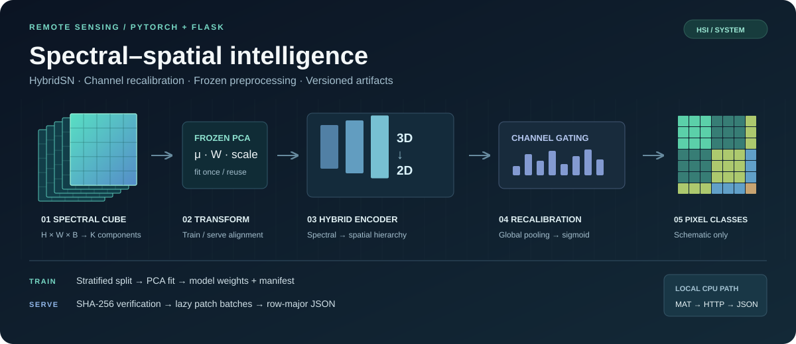

<div align="right">

[中文](README.md) · **English**

</div>

# Hyperspectral Image Classification

**Spectral–Spatial Modeling & Inference**

[](https://github.com/yuanjuju/Hyperspectral-image-classification/actions/workflows/validate.yml)


[](LICENSE)



A hyperspectral classification system built around **HybridSN 3D/2D convolutions with channel recalibration**. The Python path connects fitted PCA whitening, supervised training, versioned model artifacts and pixel-wise inference. The existing Vue / Spring Boot application provides file upload and JSON download integration.

[Architecture](docs/architecture.md) · [Operations & migration](docs/operations.md) · [API contract](docs/api.md) · [Verification](docs/verification.md) — detailed engineering documents are in Chinese.

## Engineering design

| Area | Implementation |
| --- | --- |
| Spectral–spatial representation | Three 3D convolutions, spectral/feature folding, a 2D convolution and global-pooling bottleneck channel gating |
| Training–serving consistency | PCA fitted on training pixel centers only; mean, projection and whitening scale exported alongside weights and reused at inference |
| Artifact contract | Versioned manifest, SHA-256 checks, model configuration, seed, split indices and epoch records; existing output directories cannot be overwritten |
| Inference path | Lazy spatial patches, configurable mini-batches, evaluation/inference modes and full-image predictions without ground-truth input |
| HTTP boundary | Upload-size, shape, band-count, finite-value and pixel-count checks; one active inference per process with HTTP 503 on contention |
| Regression coverage | Synthetic training, PCA numerical comparison, batch equivalence, artifact integrity, Dropout mode recovery and real loopback HTTP smoke |

## Model path

```text
H × W × B cube → frozen PCA / whitening → H × W × K
    → lazy S × S patches
    → 3D Conv × 3 → spectral/feature fold → 2D Conv
    → channel recalibration → MLP → pixel classes
```

Default configuration: `K=30`, `S=25`, `C=16`. Training uses Adam and cross-entropy over logits, with Dropout in the classifier. Tensor shapes, preprocessing semantics and memory considerations are documented in the [architecture notes](docs/architecture.md).

## Run a functional check

From the repository root, using a project-local environment:

```bash
python3.12 -m venv .venv
.venv/bin/python -m pip install --cache-dir .cache/pip -r requirements-dev.txt
.venv/bin/python -m pytest -q tests
.venv/bin/python tools/smoke.py --output .cache/smoke-local
```

The smoke check generates synthetic MAT data, runs the training CLI, exports a model artifact, starts a temporary loopback HTTP server and verifies upload predictions. It writes logs, source digests and results, then closes the server. Choose a new output directory for each run. See [operations](docs/operations.md) for actual dataset training and serving commands.

## Repository layout

| Location | Responsibility |
| --- | --- |
| `HybridSN卷积模型（flask）/main.py` | Training, evaluation records and artifact export |
| `HybridSN卷积模型（flask）/predict.py` | Flask app factory and HTTP boundary |
| `HybridSN卷积模型（flask）/src/` | Model, frozen transform, patch dataset and predictor |
| `HybridSN卷积模型（flask）/data/`, `output/` | Existing dataset, historical checkpoints and curves |
| `springboot/demo/`, `前端/vue/` | Existing Java gateway and Vue application |
| `tests/`, `tools/smoke.py`, `docs/` | Regression checks, HTTP verification and engineering notes |

## Verification and compatibility

Local verification passed **23 tests** and a two-epoch synthetic CPU training / HTTP smoke run. GitHub Actions repeats the checks on Linux CPU. [Verification records](docs/verification.md) include the environment, scope and source hashes.

The serving entry point requires a new artifact containing `weights.pt`, `preprocessor.npz` and `manifest.json`. Historical `model.pth` files and curves remain available, but lack paired PCA parameters and require migration through the new training entry point. Synthetic checks are not accuracy or throughput benchmarks. Full Java/Vue integration was not revalidated in this change.

Random labeled-center splits may contain overlapping spatial patches; they are not spatially disjoint evaluation. Epoch-level test accuracy is a monitoring metric, not an independent final benchmark.

## References and original materials

[Original README](docs/archive/README.original.md) · [Requirements](项目需求/) · [Meeting notes](会议记录/) · [Presentation](展示ppt/) · [Model references](参考资料/) · [Tutorials](工具教程/) · [Blog materials](自用博客/)

Base method: [HybridSN, Roy et al.](https://arxiv.org/abs/1902.06701), with the [authors' implementation](https://github.com/gokriznastic/HybridSN). The existing PyTorch channel-attention model is retained; the current refactor focuses on training, artifact and serving contracts. The original [MIT license and copyright](LICENSE) are preserved.
