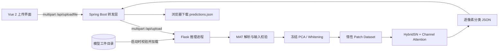

# 光谱—空间建模与推理架构

[返回首页](../README.md) · [运行手册](operations.md) · [接口契约](api.md) · [验证记录](verification.md)

## 系统边界



Web 路径来自现有 `MyHtmlPage.vue` 与 `PythonController.java`：Java 接收文件、转发给 Python，再将 JSON 作为附件返回。新版 Python 保留 `predictions` 字段，同时增加空间尺寸和整数类别，避免下游仅有字符串列表却无法恢复栅格。Vue 当前下载 JSON；它没有在这个流程里渲染分类地图。

Python 分类路径可独立运行，不需要 Java、MySQL、Redis 或问答服务。Java/Vue 和原有账户、短信、问答模块仍保留；这次验证范围是 Python 训练、工件和 HTTP 接口。

## 网络张量流

默认配置：PCA 分量 `K=30`，空间窗口 `S=25`，类别数 `C=16`，batch 为 `N`。卷积均为 stride 1、无 padding。

| 阶段 | 运算 | 输出形状 |
| --- | --- | --- |
| 输入 | 中心像素的空间邻域 | `N × 1 × 30 × 25 × 25` |
| 光谱—空间编码 I | Conv3d `1→8`, kernel `7×3×3` + ReLU | `N × 8 × 24 × 23 × 23` |
| 光谱—空间编码 II | Conv3d `8→16`, kernel `5×3×3` + ReLU | `N × 16 × 20 × 21 × 21` |
| 光谱—空间编码 III | Conv3d `16→32`, kernel `3×3×3` + ReLU | `N × 32 × 18 × 19 × 19` |
| 维度折叠 | 合并 feature / spectral axes | `N × 576 × 19 × 19` |
| 空间聚合 | Conv2d `576→64`, kernel `3×3` + ReLU | `N × 64 × 17 × 17` |
| 通道重标定 | GAP → `1×1:64→4` → ReLU → `1×1:4→64` → sigmoid | 权重 `N × 64 × 1 × 1` |
| 分类头 | 重标定 → flatten → `18496→256→128→16` | logits `N × 16` |

两个隐藏全连接层之后使用 `Dropout(p=0.43)`。训练用 CrossEntropyLoss 接收 logits；推理直接 argmax，不需要先计算 softmax。通道注意力属于全局池化与瓶颈门控结构，代码中没有 Transformer 自注意力。

新版分类头维度由 `64 × (S−8)²` 推导；默认参数仍保留原有 `18496` 输入维度。最小有效窗口为奇数 9，PCA 分量至少 13，源于三层 3D 卷积对光谱深度的连续缩减。

## 训练—服务一致性

1. 在有标签的中心像素上进行固定 seed 的分层随机划分；标签 0 不参与监督训练。
2. 仅使用训练中心像素的光谱拟合 PCA，保存均值、分量矩阵及 whitening 缩放。
3. 训练和服务共用 `SpectralTransform` 与 `PatchDataset`；服务端不对上传数据重新拟合 PCA。
4. 每轮训练重新调用 `model.train()`，恢复前一轮评估关闭的 Dropout；评估使用 `eval()` 与 `inference_mode()`。
5. 损失按样本数加权；准确率用总正确数 / 总样本数计算。导出每轮记录及实际划分索引。

变换为 `Z = (X − μ) Wᵀ / s`，其中 `s = sqrt(max(explained_variance, float32_eps))`，用于避免退化分量除零。请求输出仍需通过有限值检查。

**评估边界：** 随机中心像素划分不保证空间隔离，相邻训练与测试 patch 可能重叠。训练时记录的 `test_accuracy` 是每轮监测值；它不构成独立的最终留出集评估，也不能直接与采用不同划分的论文结果比较。固定 seed 同样不保证跨设备、跨库版本的逐位一致。

## 工件契约

```text
artifacts/<run>/
├── manifest.json         # schema、网络参数、训练参数、逐轮记录、SHA-256
├── weights.pt            # CPU state_dict
├── preprocessor.npz      # mean / components / scale
└── split_indices.npz     # row-major 训练 / 测试中心索引
```

`schema_version=1`，`architecture=HybridSN-channel-attention`，`label_offset=1`。启动时校验架构、权重与 PCA 文件摘要、PCA 形状及 state_dict；不兼容工件在接收请求前失败。权重用 `weights_only=True` 加载，NPZ 禁用 pickle。摘要用于检测文件不一致，不是来源认证或数字签名。划分索引摘要保存用于实验追踪，服务启动不读取划分索引。

导出拒绝覆盖已有目录；manifest 最后生成。但导出不是完整的跨文件事务：中断后可能留下不完整目录，需选新目录重新运行。旧 `model.pth` 未配套保存 PCA，不能仅重命名为新工件；迁移方式见[运行手册](operations.md#历史模型与兼容性)。

## 内存与并发策略

旧路径预先物化 `H×W×S×S×K` 的全部 patch。新 Dataset 保留一份补零后的 PCA 立方体，每个 batch 再切取邻域；patch 存储随 `batch_size×S²×K` 增长。模型激活、原始 MAT 解压、PCA 投影及结果列表仍占内存，因此这里不宣称整个进程具备固定内存上界。

每个 Python 进程只接纳一项正在执行的推理；并发请求返回 503，不在应用层排队。上传大小、像素数、batch 大小分别配置。进程内锁不协调多个 worker，每个 worker 都会持有独立模型。当前没有 GPU serving、动态批处理、请求持久化或跨实例调度。

## 模块导航

| 文件 | 责任 |
| --- | --- |
| `HybridSN卷积模型（flask）/main.py` | CLI、划分、训练与评估、工件导出 |
| `HybridSN卷积模型（flask）/src/model.py` | HybridSN、3D/2D 特征折叠、通道重标定 |
| `HybridSN卷积模型（flask）/src/pipeline.py` | 配置约束、冻结变换、惰性 patch、工件加载与预测 |
| `HybridSN卷积模型（flask）/predict.py` | app factory、HTTP 输入边界、健康检查、并发拒绝 |
| `tools/smoke.py` | 训练 CLI → 模型工件 → 本机真实 HTTP 的功能验证 |
| `tests/test_pipeline.py` | 数值、模式切换、工件、batch 与接口回归 |

基础 HybridSN 方法引用：[Roy et al., HybridSN: Exploring 3D–2D CNN Feature Hierarchy for Hyperspectral Image Classification](https://arxiv.org/abs/1902.06701)。本仓库保留已有 PyTorch 通道注意力实现；本轮重构重点是训练、工件与服务契约。
